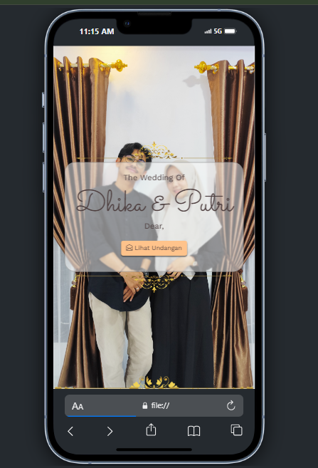
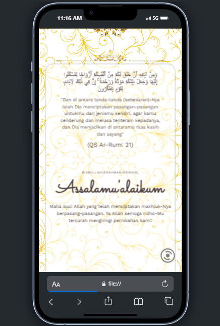
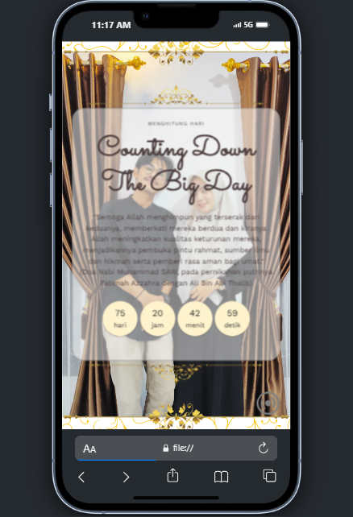
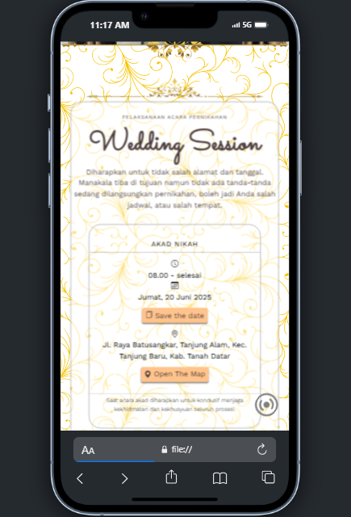
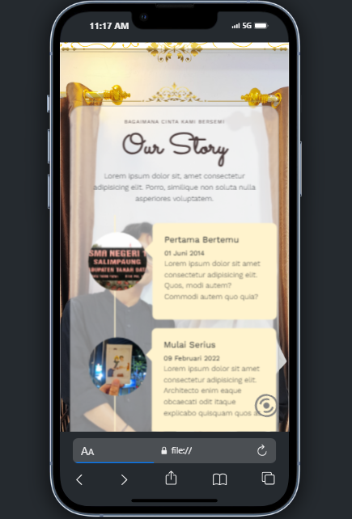
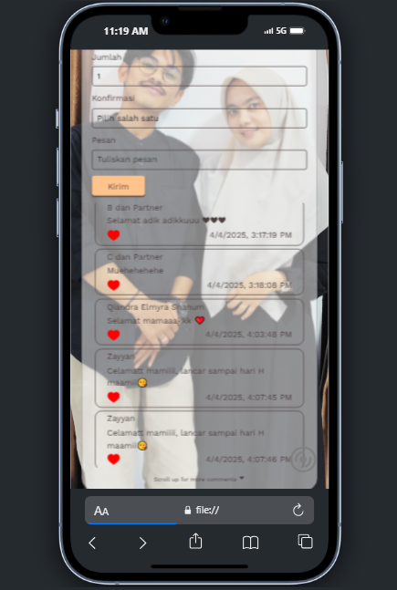
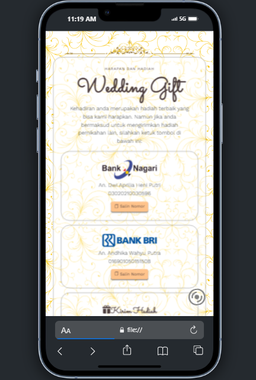
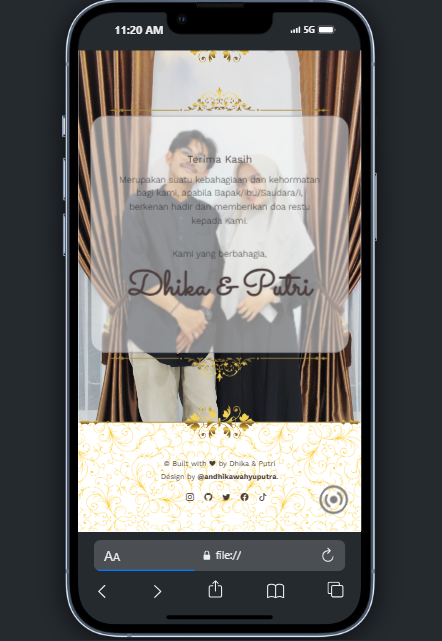

<h1 align="center">💍 Wedding Invitation of Groom & Bride 💐</h1>

<p align="center">
  
  
</p>

<p align="center">
  Sebuah undangan pernikahan digital eksklusif, dirancang dengan cita rasa <strong>elegan</strong> dan <strong>mewah</strong>, hanya untuk perangkat <strong>mobile</strong>. Undangan ini menyajikan kisah cinta Groom & Bride dalam bentuk web interaktif dengan desain yang menawan dan user-friendly.
</p>

---

## ✨ Fitur Unggulan

- 🎨 Tampilan eksklusif dengan sentuhan modern dan mewah
- 📱 Mobile-first design, dioptimalkan untuk pengguna smartphone
- 📸 Galeri foto dan cerita cinta dengan animasi elegan
- 📆 Informasi lengkap tanggal dan lokasi acara
- 📍 Integrasi Google Maps langsung ke lokasi
- 📝 RSVP digital dengan form interaktif
- 💬 Komentar & ucapan secara langsung
- 🌙 Efek animasi scroll & transisi halus

---

## 📷 Tampilan Undangan

| Tampilan 1                   | Tampilan 2                   | Tampilan 3                   |
| ---------------------------- | ---------------------------- | ---------------------------- |
|  |  |  |
| ---------------------------- | ---------------------------- | ---------------------------- |
| Tampilan 4                   | Tampilan 5                   | Tampilan 6                   |
| ---------------------------- | ---------------------------- | ---------------------------- |
|  |  |  |
| ---------------------------- | ---------------------------- | ---------------------------- |
| Tampilan 7                   | Tampilan 8                   | Tampilan 9                   |
| ---------------------------- | ---------------------------- | ---------------------------- |
|  |  |  |

---

## 📁 Struktur Folder

```
📂 wedding-a/
├── index.html                # Halaman utama undangan
├── css/
│   └── style.css             # Gaya visual (gradasi, font, layout)
├── js/
│   └── script.js             # Interaksi form & animasi
├── assets/
│   └── images/               # Gambar-gambar dekoratif dan foto mempelai
├── img/
│   └── screenshots/          # Screenshot tampilan untuk dokumentasi
└── README.md                 # File dokumentasi ini
```

---

## 🛠️ Teknologi yang Digunakan

- **HTML5 & CSS3**
- **Bootstrap 5** – untuk struktur dan utilitas responsif
- **Feather Icons / Font Awesome**
- **Google Fonts (Inter, Playfair Display)**
- **AOS (Animate On Scroll Library)** – untuk animasi scroll
- **GitHub Pages** – sebagai platform hosting gratis

---

## 🌐 Demo Live

🔗 [Lihat Undangan Digital](https://andhikawahyuputra.github.io/wedding-a/)

---

## 🚀 Cara Menjalankan

1. Clone repository ini

   ```bash
   git clone https://github.com/andhikawahyuputra/wedding-a.git
   ```

2. Buka `index.html` di browser, atau upload ke GitHub Pages untuk akses online.

---

## 🧾 Lisensi

Proyek ini menggunakan lisensi MIT. Silakan digunakan dan dimodifikasi sesuai kebutuhan.

---

## ❤️ Ucapan

Terima kasih telah berkunjung ke undangan pernikahan kami. Semoga karya ini bisa menjadi inspirasi bagi pasangan lain yang ingin membuat undangan digital penuh kesan.

> _"Dan di antara tanda-tanda kekuasaan-Nya ialah Dia menciptakan untukmu pasangan hidup dari jenismu sendiri supaya kamu merasa tenteram di sampingnya, dan dijadikan-Nya di antaramu rasa kasih dan sayang."_  
> — **QS. Ar-Rum: 21**

---

**With love,**  
💌 _Groom & Bride_
